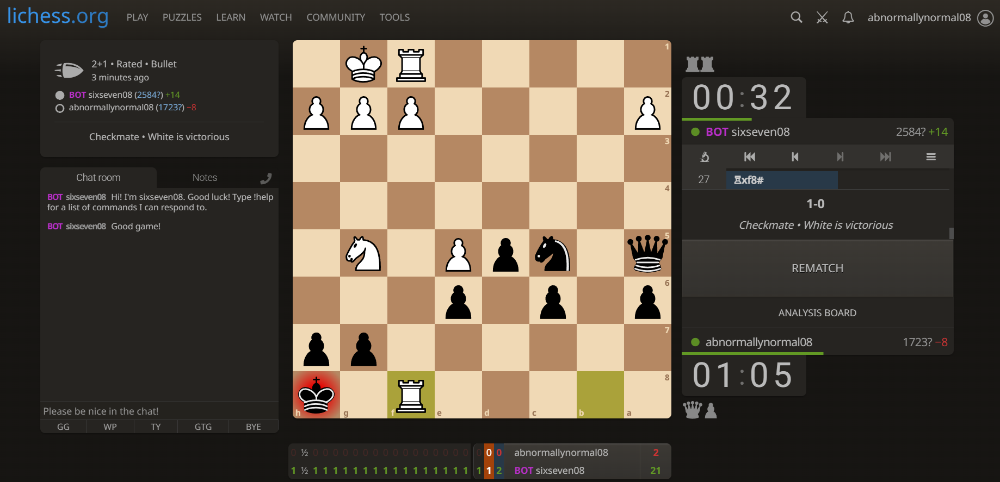

# SixSeven

> An UCI Chess Engine written from scratch in C++. It is live 24/7 on lichess.org and anyone with an account can play against it.

## What is this?

SixSeven is an UCI (Universal Chess Interface) compatible chess engine written from scratch in C++. It utilizes various techniques and uniquely integrates them to maximize the engine's performance. These techniques include:
- 64-bit integers called bitboards to store board state
- Fast move generation using precomputed perfect hash tables called magic bitboards
- Search techniques including
  - Iterative deepening
  - Negamax with alpha-beta pruning
  - Quiescence search with delta pruning
  - Null move pruning
  - Static null move pruning
  - Late move reductions (LMR)
  - Late move pruning (LMP)
- Move ordering techniques including
  - Killer move heuristic
  - History heuristic
  - Static exchange evaluation (SEE)
  - MVV-LVA (most valuable victim-least valuable attacker)
- Zobrist hash tables to store previous positions called transposition tables
- Evaluation functions considering
  - Piece placement
  - Pawn structure
  - Rook mobility
  - Bishop pair
  - Knight outposts
  - King safety
It can be played against on Lichess via the sixseven08 bot account. It has an elo of roughly 2500, achieving a positive win rate over 1000 games against Stockfish 2500.

## Why did I make this?

For the past few years, I've been an avid chess fan, playing numerous games nearly every day. Over these hundreds of games I've played, there have been numerous occasions where I missed a completely winning tactic, or made a serious blunder for a reason that I did not see. This made me wonder how chess computers got so absurdly good at the game, being able to analyze millions of positions in mere seconds. Building SixSeven was a way of answering this question myself. Throughout the process of building this engine, I've learnt a lot about lower-level programming and systems design: this project taught me bitwise operations, forced me to think carefully about memory layout and optimizing algorithms, and gave me a real appreciation for systems design in a way that no tutorial ever could. 

## How to use it

SixSeven is live on lichess.org, a global platform used to play chess against others. To play against the engine:

1. Go to lichess.org
2. Login to your account/register a new account
3. Search up sixseven08. This should navigate you to its account page, marked with a purple BOT flag
4. Create a new challenge by clicking "challenge". Ensure to select the real time mode, as it does not support unlimited time control. Also make sure the standard FIDE rules are selected.
5. Enjoy!
